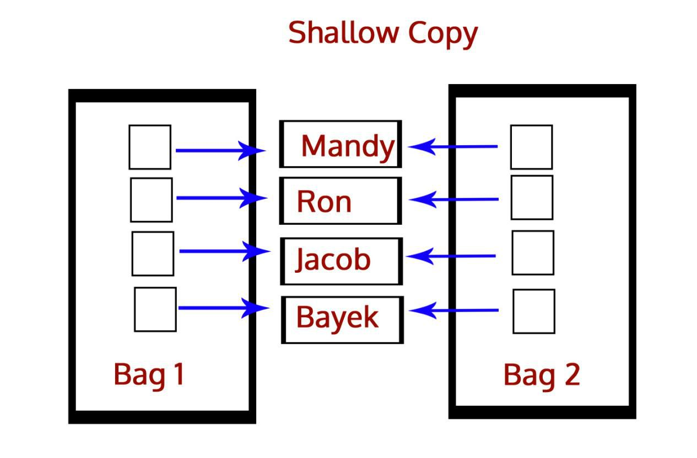

https://zhuanlan.zhihu.com/p/41199930
# 深拷贝和浅拷贝之间的区别是什么？

答：深拷贝就是将一个对象拷贝到另一个对象中，这意味着如果你对一个对象的拷贝做出改变时，不会影响原对象。在Python中，我们使用函数deepcopy()执行深拷贝，导入模块copy，如下所示：

```python
>>> import copy
>>> b=copy.deepcopy(a)
```


而浅拷贝则是将一个对象的引用拷贝到另一个对象上，所以如果我们在拷贝中改动，会影响到原对象。我们使用函数function()执行浅拷贝，使用如下所示：
```python
>>> b=copy.copy(a)
```


# 列表和元组之间的区别是？

答：二者的主要区别是列表是可变的，而元组是不可变的。举个例子，如下所示：

```python
>>> mylist=[1,3,3]
>>> mylist[1]=2
>>> mytuple=(1,3,3)
>>> mytuple[1]=2
Traceback (most recent call last):
File "<pyshell#97>", line 1, in <module>
mytuple[1]=2
```

会出现以下报错：
```python
TypeError: ‘tuple’ object does not support item assignment
```
关于列表和元组的更多内容，可以查看这里：

https://data-flair.training/blogs/python-tuples-vs-lists/

# 解释一下Python中的三元运算子
不像C++，我们在Python中没有?:，但我们有这个：
```python
[on true] if [expression] else [on false]


```

如果表达式为True，就执行[on true]中的语句。否则，就执行[on false]中的语句。

下面是使用它的方法：

```python
>>> a,b=2,3
>>> min=a if a<b else b
>>> min
```
运行结果：

```python
2
>>> print("Hi") if a<b else print("Bye")
```
运行结果：

```python
Hi
```

# 在Python中如何实现多线程？
一个线程就是一个轻量级进程，多线程能让我们一次执行多个线程。我们都知道，Python是多线程语言，其内置有多线程工具包。

Python中的GIL（全局解释器锁）确保一次执行单个线程。一个线程保存GIL并在将其传递给下个线程之前执行一些操作，这会让我们产生并行运行的错觉。但实际上，只是线程在CPU上轮流运行。当然，所有的传递会增加程序执行的内存压力。

# 解释一下Python中的继承
当一个类继承自另一个类，它就被称为一个子类/派生类，继承自父类/基类/超类。它会继承/获取所有类成员（属性和方法）。

继承能让我们重新使用代码，也能更容易的创建和维护应用。Python支持如下种类的继承：

单继承：一个类继承自单个基类
多继承：一个类继承自多个基类
多级继承：一个类继承自单个基类，后者则继承自另一个基类
分层继承：多个类继承自单个基类
混合继承：两种或多种类型继承的混合
更多关于继承的内容，参见：

https://data-flair.training/blogs/python-inheritance/

#  Python中的字典是什么？
字典是C++和Java等编程语言中所没有的东西，它具有键值对。

```python
>>> roots={25:5,16:4,9:3,4:2,1:1}
>>> type(roots)
<class 'dict'>
>>> roots[9]
```

运行结果为：

```python
3
```

字典是不可变的，我们也能用一个推导式来创建它。

```python
>>> roots={x**2:x for x in range(5,0,-1)}
>>> roots
```

运行结果：

```python
{25: 5, 16: 4, 9: 3, 4: 2, 1: 1}
```

#  请解释使用*args和**kwargs的含义
当我们不知道向函数传递多少参数时，比如我们向传递一个列表或元组，我们就使用*args。

```python
>>> def func(*args):
    for i in args:
        print(i)  
>>> func(3,2,1,4,7)
```

运行结果为：

```python
3
 
2
 
1
 
4
 
7
```
在我们不知道该传递多少关键字参数时，使用**kwargs来收集关键字参数。
```python
>>> def func(**kwargs):
    for i in kwargs:
        print(i,kwargs[i])
>>> func(a=1,b=2,c=7)
```
运行结果为：

```python
a.1
 
b.2
 
c.7
```

# 请写一个Python逻辑，计算一个文件中的大写字母数量
```python
>>> import os

>>> os.chdir('C:\\Users\\lifei\\Desktop')
>>> with open('Today.txt') as today:
    count=0
    for i in today.read():
        if i.isupper():
            count+=1
print(count)
```
运行结果：
```python
26
```