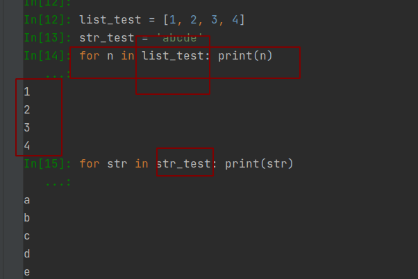
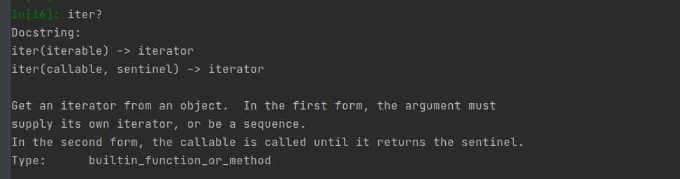
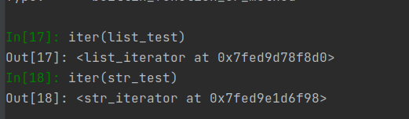
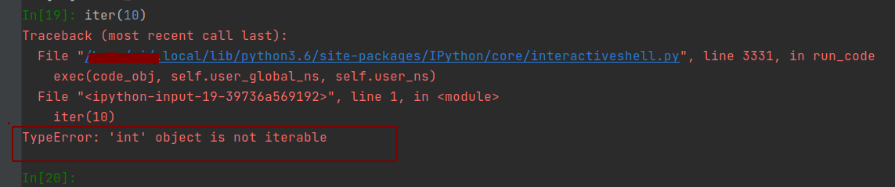
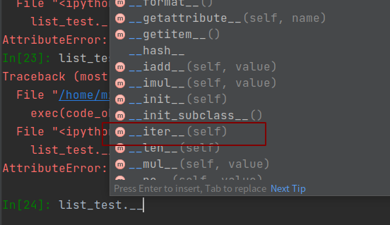
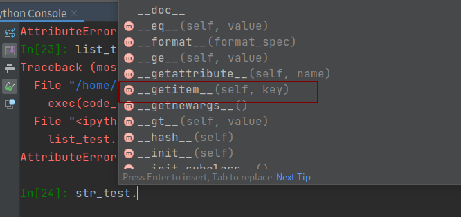
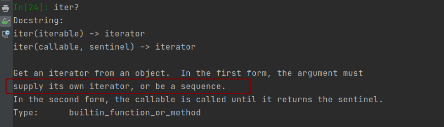
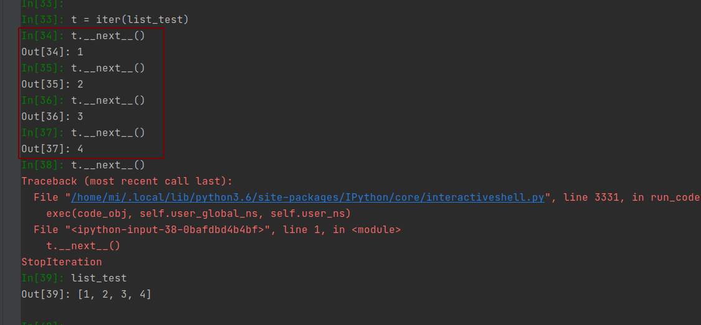

# 可迭代对象

首选确保for循环的in后面是一个可迭代对象，这样就能通过python内置函数`iter()`得到一个迭代器对象（iterator）



我们分别把列表list_test和字符串str_test分别得到一个迭代器
我们尝试传入数字看看

这里抛出了异常，因为数字不是一个可迭代对象

那么问题来了，　为什么列表和字符串是可迭代对象?
因为这些对象满足了特殊的接口：

迭代列表时候，我们看看了列表下__开头的方法,其中的__iter__()就是迭代协议的接口。我们在使用iter(list_test)时候实际内部调用了这个__iter__()函数
我们再看迭代字符串时候，**我们发现没有找到__iter__()** , 但是有__getIterm__()这个接口

我们再看看迭代的签名, 要么传入的参数（对象）本身有迭代器，要么是一个序列。　我们这里list__test本身就有迭代器，而str_test是有__getItem__这种序列的接口。


# 迭代器对象

```python
for n in list_test: 
    print(n) 
```
所以我们就搞清楚了，for循环中先由iter(list_test)得到一个迭代器t,然后不停的调用next next next 直到捕获到一个`StopIteration` 异常，跳出循环。
这就是for循环的工作流程

# 案例实现
> 我们从天气应用抓取各个城市温度：
> 北京: 10~18
> 南京: 13~23
> 上海: 14~22
....
>如果一次性抓取所有天气再显示，显示一个城市气温时，会有很多延迟。并且浪费存储空间。　我们希望以“用时访问”的策略，能把所有城市气温封装到一个对象里面，需要时候再显示。
> 提示，　可用for语句进行迭代。　代码怎么实现?

解决思路
- 1. 实现一个迭代器对象Weatherlterator, next方法每次返回一个城市气温.（迭代完毕时候要抛出停止迭代异常）
- 2. 实现一个可迭代对象Weatherlterable, __iter__方法返回一个迭代器对象。
    

    


