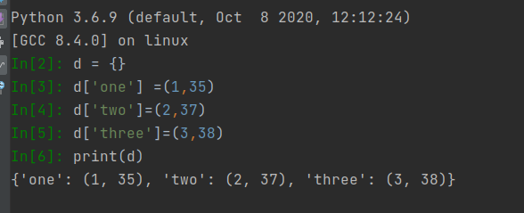

微信公众号原文阅读： [【Python Tips】python3.6之前 OrderedDict类（有序字典）](https://mp.weixin.qq.com/s?__biz=MzkyMjE4NTA4OQ==&mid=2247484124&idx=1&sn=56893356d430dd6e2a5e282b2e85d3c0&chksm=c1f97e32f68ef7244278a33a487b97af22beabad766abde7e6b638c6eb3fe69412844a6d20cc&token=1100837125&lang=zh_CN#rd)
> > 最新在学习一些知识用到有序字典，看到别人使用OrderedDict（）。但查阅资料发现，python3.6（包含）之后，所有的普通dict（）字典都变为有序的了，不再需要OrderedDict（）这个类了。如果你还是使用python2，或python3.5之前的版本，那可以继续浏览下，否者就没必须看了。

先说结论
- python3.5 字典是无序的

- python3.6 只有显示出来的是有序的 但实际上 也是无序的



- python3.7之后 字典就是有序的

所以python3.6版本以前要想让字典有序，需要使用collections模块的OrderedDict

```python
from collections import OrderedDict
d = OrderedDict()
d['one'] =(1,35)
d['two']=(2,37)
d['three']=(3,38)
print(d)
```
<b>补充一种在ubuntu下切换python版本方法</b>
Ubuntu自带python2，有时候需要使用pytho3。该如何切换呢？

使用 update-alternatives

操作方法：

建立链接：
```bash
sudo update-alternatives --install /usr/bin/python python /usr/local/lib/python2.7 100
sudo update-alternatives --install /usr/bin/python python /usr/local/lib/python3.2 150
```

查看当前python版本
```bash
python --version

```

如果要切换到Python2，执行：
```bash
sudo update-alternatives --config python
```

按照提示输入选择数字回车即可


### 原理：
update-alternatives是Debian提供的一个工具(非Debian系的就不用看了)，原理类似于上面一个办法，也是通过链接的方式，但是其切换的过程非常方便。

首先看一下update-alternatives的帮助信息：

```bash
$ update-alternatives --help
用法：update-alternatives [<选项> ...] <命令>
 
命令：
  --install <链接> <名称> <路径> <优先级>
    [--slave <链接> <名称> <路径>] ...
                           在系统中加入一组候选项。
  --remove <名称> <路径>   从 <名称> 替换组中去除 <路径> 项。
  --remove-all <名称>      从替换系统中删除 <名称> 替换组。
  --auto <名称>            将 <名称> 的主链接切换到自动模式。
  --display <名称>         显示关于 <名称> 替换组的信息。
  --query <名称>           机器可读版的 --display <名称>.
  --list <名称>            列出 <名称> 替换组中所有的可用候选项。
  --get-selections         列出主要候选项名称以及它们的状态。
  --set-selections         从标准输入中读入候选项的状态。
  --config <名称>          列出 <名称> 替换组中的可选项，并就使用其中
                           哪一个，征询用户的意见。
  --set <名称> <路径>      将 <路径> 设置为 <名称> 的候选项。
  --all                    对所有可选项一一调用 --config 命令。
 
<链接> 是指向 /etc/alternatives/<名称> 的符号链接。
    (如 /usr/bin/pager)
<名称> 是该链接替换组的主控名。
    (如 pager)
<路径> 是候选项目标文件的位置。
    (如 /usr/bin/less)
<优先级> 是一个整数，在自动模式下，这个数字越高的选项，其优先级也就越高。
 
选项：
  --altdir <目录>          改变候选项目录。
  --admindir <目录>        设置 statoverride 文件的目录。
  --log <文件>             改变日志文件。
  --force                  就算没有通过自检，也强制执行操作。
  --skip-auto              在自动模式中跳过设置正确候选项的提示
                           (只与 --config 有关)
  --verbose                启用详细输出。
  --quiet                  安静模式，输出尽可能少的信息。不显示输出信息。
  --help                   显示本帮助信息。
  --version                显示版本信息。
```


我们仅需要了解3个参数就行了

- --install <链接> <名称> <路径> <优先级> ：建立一组候选项
- --config <名称> ：配置 <名称>组中的可选项，并选择使用其中哪一个
- --remove <名称> <路径> ：从 <名称>中去掉 <路径>选项
首先我们先看一下有没有关于Python的可选项：
```bash
$ update-alternatives --display python
update-alternatives: 错误: 无 python 的候选项
```

那首先先建立python的组,并添加Python2和Python3的可选项
```bash
$ sudo update-alternatives --install /usr/bin/python python /usr/bin/python2.7 2 # 添加Python2可选项，优先级为2
$ sudo update-alternatives --install /usr/bin/python python /usr/bin/python3.4 1 #添加Python3可选项，优先级为1

```
如果你想要删除某个可选项的话：
```bash
$ sudo update-alternatives --remove python /usr/bin/python2.7
```


# 问题背景

